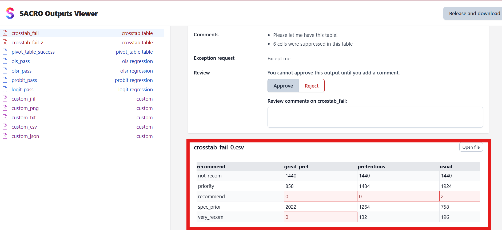

==========
User Guide
==========

This guide explains how to use SACRO Viewer to review research outputs and manage the approval process for secure release.

Getting Started
===============

When you launch SACRO Viewer, you'll be prompted to select a directory containing the outputs you wish to review. The application will automatically detect ACRO metadata and display the outputs for review.

**Selecting Output Directory**

1. Launch SACRO Viewer
2. A file dialog will appear asking you to choose a directory
3. Navigate to and select the folder containing your research outputs
4. Click "Select Folder" to load the outputs

If the directory contains ACRO-generated metadata (typically ``outputs.json``), the viewer will use this to display detailed information about each output. If no ACRO metadata is found, the viewer will automatically generate metadata for all files in the directory, treating them as "custom" outputs requiring review.

Main Interface
==============

The SACRO Viewer interface consists of three main areas:

.. image:: images/Output_List.png
   :alt: Main Interface
   :align: center
   :width: 80%

**Output List (Left Panel)**
  Shows all outputs in the selected directory with their names and types. Outputs are color-coded:

  * **Red icons**: Failed ACRO checks or outputs requiring attention
  * **Blue icons**: Passed ACRO checks or successful outputs
  * **Gray icons**: Custom outputs (non-ACRO files)

**File Viewer (Bottom Right)**
  Displays the contents of the selected output file. Supports various formats:

  * **CSV files**: Displayed as formatted tables with cell highlighting
  * **Images**: PNG, JFIF, and other image formats shown inline
  * **Text files**: Plain text with syntax highlighting
  * **JSON files**: Formatted JSON with proper indentation

.. image:: images/Review_Panel.png
   :alt: Main Interface
   :align: center
   :width: 80%

**Review Panel (Top Right)**
  Contains all information needed for making approval decisions:

  * **ACRO Status**: Shows pass/fail status and any warnings
  * **Comments**: Researcher-provided comments and justifications
  * **Exception Request**: Any special requests from the researcher
  * **Review Section**: Your approval decision and comments

Making Review Decisions
======================

For each output, you need to make an approval decision based on the ACRO analysis, researcher comments, and file contents.

**Review Process**

1. **Select an output** from the left panel to view its details
2. **Examine the ACRO status** - this shows the automated privacy assessment
3. **Read researcher comments** to understand the context and any special circumstances
4. **View the file contents** to verify what is being requested for release
5. **Make your decision** using the Approve/Reject buttons
6. **Add review comments** explaining your decision (optional but recommended)

**ACRO Status Indicators**

* **Pass**: ACRO determined the output is safe for release
* **Fail**: ACRO identified potential disclosure risks (e.g., "threshold: 4 cells may need suppressing")
* **Review**: Manual review required due to uncertainty or special circumstances

**Approval Guidelines**

* **Approve** outputs that pass ACRO checks and have valid researcher justifications
* **Reject** outputs with clear disclosure risks or insufficient justification
* **Consider carefully** outputs that failed ACRO checks but have researcher exception requests

File Types and Display
=====================

SACRO Viewer handles various output file types commonly produced in research:

**Statistical Tables (CSV)**
  * Displayed as formatted tables with proper column alignment
  * Cells flagged by ACRO for potential disclosure risks are highlighted
  * Cell coordinates are shown for reference in ACRO reports

**Images and Plots**
  * PNG, JFIF, and other image formats displayed inline
  * Plots and charts can be viewed at full resolution
  * "Open file" button available for viewing in external applications

**Text and Code Files**
  * Plain text files displayed with appropriate formatting
  * Code files shown with syntax highlighting where possible
  * Large files may be truncated for performance

**JSON and Metadata**
  * JSON files displayed with proper formatting and indentation
  * ACRO metadata files show the complete analysis results
  * Nested structures are clearly presented

Completing the Review
====================

Once you have reviewed all outputs and made approval decisions, you can generate the final release package.

**Release Process**

1. **Review all outputs** - ensure every item has an approval decision
2. **Click "Release and download"** button (appears when all outputs are reviewed)
3. **Add final comments** about the overall review in the dialog that appears
4. **Confirm the release** to generate the approved outputs package

**Release Package Contents**

The generated ZIP file contains:

* **Approved output files** - only files you approved for release
* **Release metadata** - summary of approval decisions and comments
* **Audit information** - reviewer details and timestamps
* **Checksums** - file integrity verification data

**Audit Trail**

SACRO Viewer maintains a complete audit trail including:

* Individual approval/rejection decisions for each output
* Reviewer comments and justifications
* Timestamps of all review actions
* File checksums for integrity verification
* Release package metadata

Working with Different Output Types
==================================

**ACRO-Generated Outputs**
  These outputs include comprehensive metadata about statistical disclosure control checks, researcher comments, and automated risk assessments. Use this information to make informed decisions about release approval.

**Custom Outputs**
  Files without ACRO metadata are treated as custom outputs requiring manual review. These appear with generic metadata and require careful examination of file contents to assess disclosure risks.

**Mixed Directories**
  Directories containing both ACRO and non-ACRO outputs are handled seamlessly. The viewer will use ACRO metadata where available and generate custom metadata for other files.

Best Practices
==============

**Review Workflow**
  * Start with outputs that passed ACRO checks - these are typically safe to approve
  * Pay special attention to failed outputs and exception requests
  * Document your reasoning in review comments for audit purposes
  * Verify file contents match the researcher's description

**Security Considerations**
  * Always verify file checksums match the expected values
  * Be cautious with outputs containing small cell counts or potentially identifying information
  * Consider the cumulative disclosure risk across multiple related outputs
  * When in doubt, err on the side of caution and reject questionable outputs

**Efficiency Tips**
  * Use keyboard shortcuts where available for faster navigation
  * Group similar outputs for batch review when appropriate
  * Keep researcher contact information handy for clarification requests
  * Maintain consistent approval criteria across similar output types
